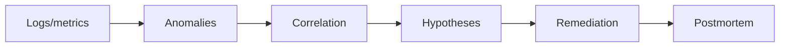

# 05 - AI Incident Response Copilot

[](https://github.com/milos-plavsic/ai-incident-response-copilot/actions/workflows/ci.yml)
[](https://www.python.org/downloads/)

An operations-focused AI system that ingests logs and telemetry, builds root-cause hypothesis graphs, and proposes remediation steps with confidence estimates.

## Quickstart

```bash
make install
make run
make api
make test
```

Docker API: `make docker-api`.

## API

- OpenAPI docs: `http://127.0.0.1:8000/docs`
- Health: `GET /health`
- Incident analysis: `POST /v1/incidents/analyze` with JSON body `{"incident":"..."}`

## Architecture



## Why This Project Stands Out

- Solves a real SRE/DevOps pain point.
- Combines ML anomaly signals with LLM reasoning.
- Produces structured incident narratives and action plans.

## Core Capabilities

- Log/metric ingestion from synthetic or real traces.
- Temporal anomaly detection and correlation clustering.
- Root-cause hypothesis graph construction.
- Remediation suggestion ranking with rationale.
- Postmortem draft generation from incident timeline.

## Suggested Tech Stack

- Python 3.11+
- `pandas`, `scikit-learn`, `langgraph`, `fastapi`, `plotly`
- Optional: OpenSearch/Elastic ingestion adapters

## Architecture (Graph)

`ingest_signals -> anomaly_detector -> correlation_engine -> hypothesis_builder -> remediation_planner -> confidence_scorer -> postmortem_writer`

## Usage Suggestions

- Start with synthetic outage scenarios to validate logic.
- Introduce feedback loop from human incident commander.
- Keep confidence calibration visible to build trust.

## Portfolio Additions

- Timeline view with anomaly markers and decisions.
- Top-3 hypothesis comparison panel.
- MTTR reduction simulation from suggested playbooks.

## Milestones

- `v0.1`: parse + summarize incidents.
- `v0.2`: anomaly + hypothesis graph.
- `v0.3`: remediation ranking and confidence scoring.
- `v1.0`: interactive dashboard and report export.

## Demo Scenarios

1. API latency spike due to failing downstream dependency.
2. Database saturation after deployment regression.
3. Intermittent auth failures tied to cache invalidation.
